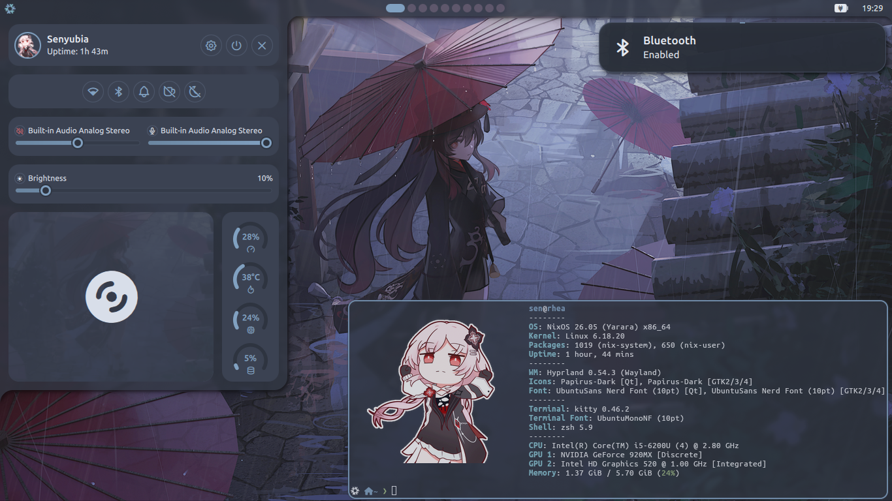

# NixOS
My NixOS configs


## Installation
From a live NixOS ISO environment (with Internet connection):
```
clone https://github.com/senyubia/nix.git
sudo nix --experimental-features "nix-command flakes" run github:nix-community/disko/latest -- --mode destroy,format,mount ./nix/hosts/<HOST>/disk.nix
sudo nixos-install --flake ./nix#<HOSTNAME>
sudo nixos-enter
passwd <USER>
exit
shutdown now
```
```HOST``` - the desired machine from hosts folder in the repo

```HOSTNAME``` - the machine's hostname (from info.nix)

```USER``` - the machine's user (from info.nix)